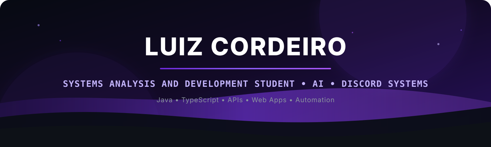

<div align="center">



<br />


</div>

---

## 👨‍💻 Sobre mim

```ts
const luiz = {
  name: "Luiz Cordeiro",
  role: "Software Developer",
  focus: [
    "Discord Bots",
    "Web Applications",
    "APIs & Integrations",
    "Automation",
    "AI-powered experiences"
  ],
  backend: ["Java", "Node.js"],
  frontend: ["TypeScript", "JavaScript", "HTML", "CSS"],
  database: ["PostgreSQL", "Redis"],
  tools: ["Git", "GitHub", "Maven", "Vercel", "VS Code"],
  currentlyBuilding: "Kayn",
  mindset: "Transforming ideas into complete digital products 🚀"
};
```

- ☕ Desenvolvimento de aplicações e bots com **Java**
- 🌐 Criação de aplicações web com **TypeScript / JavaScript**
- 🤖 Bots, automações, APIs e integrações para Discord
- 🗄️ Experiência baixa/média com **PostgreSQL** e **Redis**
- 🎮 Desenvolvimento de recursos para comunidades e experiências gamer
- 🚀 Foco em transformar projetos em produtos completos, utilizáveis e escaláveis
- 🧠 Interesse crescente em **IA aplicada a produtos, automação e experiências interativas**
- ⚙️ Gosto de trabalhar do backend à interface, conectando lógica, dados e experiência do usuário

---

## 🚀 Projeto principal: Kayn

<div align="center">


### Bot multifuncional para Discord

O **Kayn** reúne comunidade, entretenimento, cards, economia, música, moderação, recursos gamer, inteligência artificial e ferramentas para servidores do Discord.

[](https://kaynoficial.vercel.app/)
[](https://github.com/luizcordeiro155/KaynDC)

</div>

**Stack principal:** Java 21, JDA 5, Maven, PostgreSQL, Redis, Discord e Vercel.

### Alguns pilares do projeto

- 🎵 Sistema de música e reprodução em servidores
- 🃏 Cards, economia, progressão e recursos de comunidade
- 🤖 Recursos com inteligência artificial e automações
- 🌐 Painel web integrado ao ecossistema do bot
- 🌍 Experiência multilíngue e recursos voltados a comunidades internacionais
- 🔐 Estrutura premium, autenticação e integrações externas
- 🎮 Funcionalidades pensadas para comunidades gamers

---

## 💻 Linguagens e tecnologias

<div align="center">


</div>

---

## 🛠️ Stack visual

<div align="center">
  
</div>

---

## 💻 Projetos em destaque

<table>
  <tr>
    <td width="50%" valign="top">
      <h3>🤖 Kayn</h3>
      <p>Bot multifuncional para Discord com sistemas de comunidade, entretenimento, música, cards, economia, moderação, IA e recursos gamer.</p>
      <p>
        
        
        
        
        
      </p>
      <a href="https://kaynoficial.vercel.app/"><b>Acessar site oficial →</b></a>
    </td>
    <td width="50%" valign="top">
      <h3>☀️ Painel Solar</h3>
      <p>Aplicação web desenvolvida para cliente de instalação de Painéis Solares.</p>
      <p>
        
        
      </p>
      <a href="https://github.com/luizcordeiro155/Painel-Solar"><b>Ver repositório →</b></a>
    </td>
  </tr>
  <tr>
    <td width="50%" valign="top">
      <h3>🏥 Planos de Saúde</h3>
      <p>Projeto web criado para apresentação e organização de planos de saúde da empresa SW.</p>
      <p>
        
      </p>
      <a href="https://github.com/luizcordeiro155/Planos-de-saude"><b>Ver repositório →</b></a>
    </td>
    <td width="50%" valign="top">
      <h3>🧩 Ecossistema Kayn</h3>
      <p>Conjunto de aplicações, painéis e serviços que complementam o Kayn e conectam bot, web, dados e experiência do usuário.</p>
      <p>
        
        
        
      </p>
      <a href="https://github.com/luizcordeiro155?tab=repositories"><b>Explorar meus projetos →</b></a>
    </td>
  </tr>
</table>

---

## 📊 GitHub em números

<div align="center">


<br />


</div>

---

## 🐍 Commits

<div align="center">
  <picture>
    <source media="(prefers-color-scheme: dark)" srcset="https://raw.githubusercontent.com/luizcordeiro155/luizcordeiro155/output/github-contribution-grid-snake-dark.svg" />
    <source media="(prefers-color-scheme: light)" srcset="https://raw.githubusercontent.com/luizcordeiro155/luizcordeiro155/output/github-contribution-grid-snake.svg" />
    
  </picture>
</div>

---

## 🎯 Atualmente focado em

- Evoluir a arquitetura e o ecossistema do **Kayn**
- Criar experiências mais inteligentes para comunidades online
- Melhorar integrações entre **Discord, web, banco de dados e APIs**
- Aprimorar UI/UX dos produtos que desenvolvo
- Aprofundar conhecimentos em engenharia de software, arquitetura e IA aplicada

---

## 🔗 Links

<div align="center">
  <a href="https://github.com/luizcordeiro155">
    
  </a>
  <a href="https://kaynoficial.vercel.app/">
    
  </a>
  <a href="https://github.com/luizcordeiro155?tab=repositories">
    
  </a>
</div>

<br />

<div align="center">
  <sub>Construindo bots, aplicações web, automações e produtos digitais.</sub>
</div>
